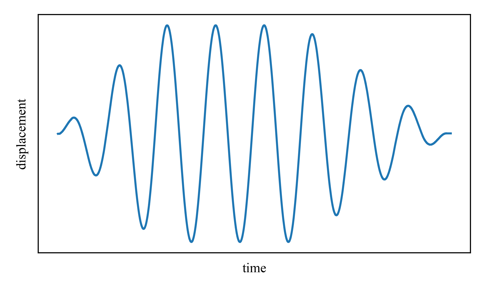

# Dataset-Friction-Damper-with-Backlash

This dataset comes from tests of the banded rotary friction device (BRFD), which exhibits hysteritic and backlash effects. 

   

Characterization datasets were performed by moving the damper under a sinusoidal displacement such as shown below. The wind profile tests were performed in a hybrid test where displacment from a simulated structure under wind diplacement was fed into the damper. This test was performed in real-time so that reactions from the damper were captured and used in the structure simulation.

   

  

Access each dataset by loading the .json file for each test. Data is stored in a matrix with columns time (s), displacement (in), friction force (kip), velocity (in/s), actuatator force 1 (lb), actuator force 2 (lb). See `example.py` for how to load tests.
